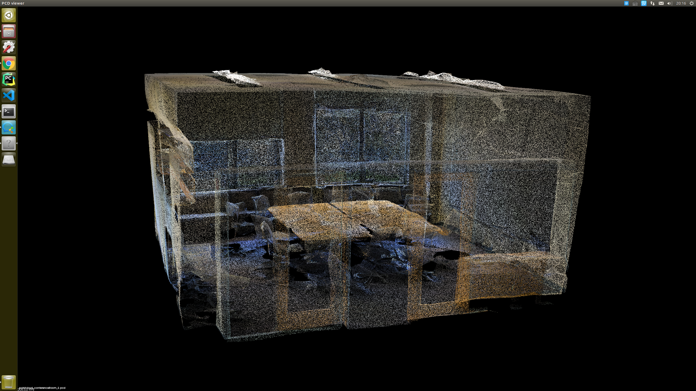

# S3DIS数据集解析

S3DIS数据集是斯坦福大学开发的带有像素级语义标注的语义数据集，包含了rgb，depth，3d点云、mesh等。

官网：http://buildingparser.stanford.edu/dataset.html

github：https://github.com/alexsax/2D-3D-Semantics

### 数据格式


还原点云数据有多种方式，可以通过直接解析自带的mat文件进行解析，也可以通过合成rgb和深度图进行解析。本文以Area_1数据为例。

## 1.直接解析pointcloud.mat文件

数据集自带的mat文件包含了每一label的点云坐标、rgb，标注、物体体积、是否占有能属性组成。数据结构如下：


该mat文件包含一个struct结构体，结构体又往下分级。

可以用python直接解析该mat文件，本人对python不太熟悉，因此最后采用了将该mat文件转化为json脚本的形式，通过c++进行解析。

通过matlab解析json非常简单，只需要下载安装一个插件JSONlab，对应链接：https://github.com/fangq/jsonlab/#installation，

添加到matlab的toolkit文件加中，再将路径添加进行即可。matlab程序如下：

```matlab
load('pointcloud.mat')
name_ALL = Area_1.Disjoint_Space;
for i=1:1:44
    name=savejson('',name_ALL(i));
    fid=fopen(['Adata_',num2str(i),'.json'],'w+');
    fprintf(fid,'%s',name);
    fclose(fid);
    fprintf('%s \n',i);
end
```

本次只针对一个场景即Area_1进行解析，因此只采集了object所有对象下的结构体，该结构体下又包含多个子类，每一类都有对应的一套属性。

每个对象的内容如下：

```json
{
	"name": "conferenceRoom_1",
	"AlignmentAngle": -0,
	"color": [0.5,0.5,0],
	"object": [
		{
			"name": "beam_1",
			"RGB_color": [
				[71,64,54],
				[68,64,52],
				...
				...
				[-15.296,40.53,2.19]
				]
			
		}
	]
}
```

object结构体下包含了其他如坐标、Voxels等信息。在这里将所有对象的数据分别存入不同文件（避免文件过大）


通过这种方式，将点云文件转化为json格式，再通过c++读取即可。

json解析函数根据官方提供的代码进行了修改，官方代码只是用来解析pose.josn数据的，这里用`boost::property_tree::ptree`来解析json格式。

pcl_utils文件给出了解析json中点云坐标和rgb的程序。可根据文件树添加其他数据的解析程序，json的解析方式是一样的，只需要调整一下解析程序中的层数和对应的name即可。

主函数如下，主要是通过调用点云数据和rgb数据进行整体点云的拼接。由于点云数量过大，因此最后还是按文件分别保存了pcd文件。

由此可以生成以文件为单位的点云数据，取其中一个生成的点云如图：



main程序中注释的部分为最后将所有的点云pcd文件合成一个点云的代码，最后Area_1的整体点云效果如图：


本人i7-8700HQ+16g内存仍然很卡。

## 2.通过data文件夹中的pose合成rgb和depth

之前一直在用这种方式做，调了整整两天的程序终于调通了，结果发现数据中的depth很有问题，合成的图片深度分层很严重，而且分层比较均匀，不像是程序的问题。采用的方法是通过读取data文件夹下的pose.json文件获取对应的相机位姿，再根据相机内参，将depth投影到空间去，并附上rgb信息。然而最后因结果不好而放弃。且自己合成点云非常消耗计算量，电脑跑一会就卡的要死，最好不要采用这种方式，直接使用mat文件中的数据即可。
